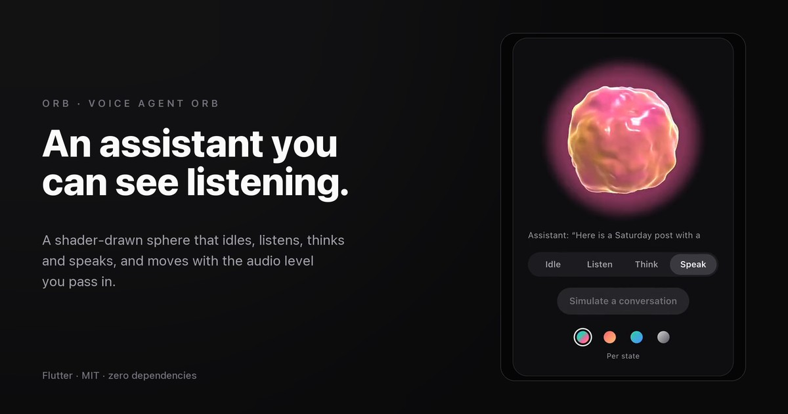

# Orb

A voice agent orb for Flutter. A shader-drawn sphere that **idles, listens,
thinks and speaks**, each with its own motion and colour, and moves with the
audio level you pass in.

**[→ Live demo](https://yagnikbarasiya23.github.io/orb_voice_visualizer/)** (the example app, built for the web)



No dependencies beyond Flutter. There's also a [web version](https://github.com/YagnikBarasiya23/orb-voice-visualizer).

## Install

```yaml
dependencies:
  orb_voice_visualizer:
    git:
      url: https://github.com/YagnikBarasiya23/orb_voice_visualizer.git
```

Requires Flutter 3.47 or newer.

## Use it

```dart
import 'package:orb_voice_visualizer/orb_voice_visualizer.dart';

Orb(
  state: OrbState.listening,   // idle | listening | thinking | speaking
  level: micLevel,             // 0–1
  size: 240,
)
```

### Feeding it audio

Orb doesn't open the microphone itself, so it works with whatever audio
package you already use. Most report loudness in dBFS; `levelFromDecibels`
turns that into 0–1.

With [`record`](https://pub.dev/packages/record):

```dart
final recorder = AudioRecorder();
await recorder.start(const RecordConfig(), path: path);

Orb(
  state: OrbState.listening,
  levelStream: recorder
      .onAmplitudeChanged(const Duration(milliseconds: 50))
      .map((amplitude) => levelFromDecibels(amplitude.current)),
)
```

With a realtime voice SDK, map its events to `state` and pass its output
level to `level` or `levelStream`.

### Colours

```dart
Orb(colors: OrbColors.all(Color(0xFFFF5F6D), Color(0xFFFFC371)))
Orb(colors: OrbColors.perState({OrbState.speaking: (Color(0xFFFF5FA2), Color(0xFFFFB347))}))
```

## API

| Parameter | What it does |
| --- | --- |
| `state` | `idle`, `listening`, `thinking` or `speaking`; changes blend over 400 ms |
| `level` | Loudness 0–1 |
| `levelStream` | Loudness as a `Stream<double>`; wins over `level` once it has sent a value |
| `colors` | `OrbColors.all(a, b)`, `OrbColors.perState({...})` or the default `OrbColors.standard` |
| `size` | Width and height |
| `semanticsLabel` | What screen readers hear; defaults to "Assistant is listening" and so on |

## How it works

**One shader.** `shaders/orb.frag` ray-marches a sphere whose surface is
pushed in and out by four octaves of 3D noise, then lights it with a rim term
and a two-colour band, with a soft halo outside. It's the same maths as the
web version. Until the shader has loaded, a painted gradient disc stands in.

**Levels through a spring.** The level you pass in drives a critically damped
spring, so the orb swells quickly and settles smoothly instead of jittering.

**States blend.** Each state is a set of numbers: flow speed, depth, halo,
how much audio matters, and two colours. Switching state interpolates all of
them over 400 ms, and the noise advances by accumulated phase so a speed
change never makes the surface jump.

**Considerate.** The ticker pauses with `TickerMode` when the route is
hidden. Reduce motion slows it to a gentle breath. Screen readers hear the
state.

## Run the demo

```bash
cd example
flutter run -d chrome
```

```bash
flutter test      # from the package root
```

## License

MIT © 2026 Yagnik Barasiya
